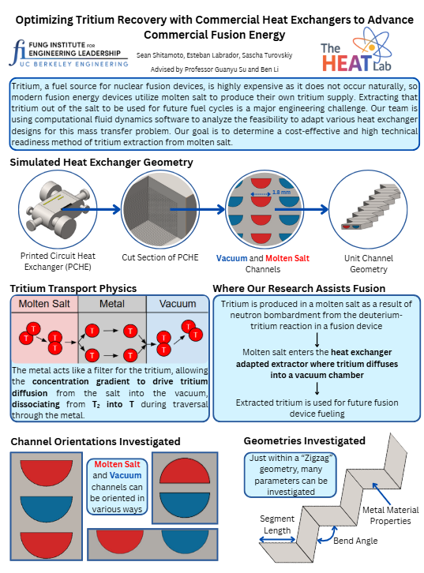

# Tritium-Extraction-Unit
As part of a team of three for our UC Berkeley Capstone Project, we designed a tritium extraction system for fusion reactors under the guidance of Dr. Guanyu Su. The project was entirely simulation-based and involved modeling with Star-CCM+ and SolidWorks. None of us had used Star-CCM+ prior to this project.

Together, we developed a realistic model simulating the transport of tritium from FLiBe to the vacuum, including permeation through metallic walls. After jointly building the core model, I led a segment length sensitivity study to analyze how heat exchanger geometry influences tritium extraction efficiency.

Through this project, I gained hands-on experience in meshing, defining custom boundary conditions using user-defined equations, and working with passive scalars to simulate species transport.
This is our One Pager

We went to the ANS Student Conference 2025 to present our work.
[here](./ANS%Conference%2025%Presentation.pptx.pdf).
## 📄 Report
The full project report can be found [here](./Project_Tritium_Extraction_FinalReport_2025.pdf).
