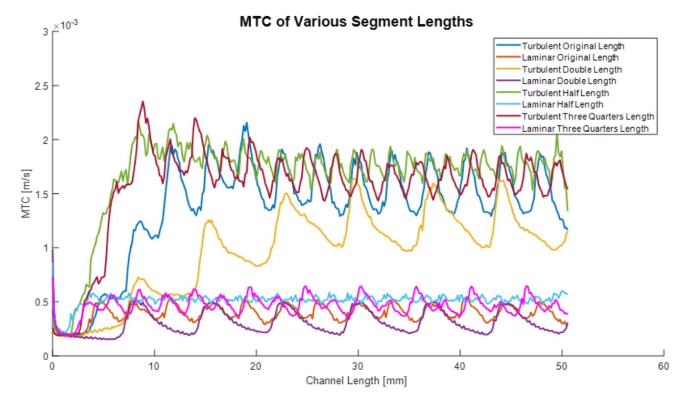

# 🔬 Optimizing Tritium Recovery Using Commercial Heat Exchangers 

**Contributors:** Esteban Labrador, Sean Shitamoto, Sascha Turovskiy  
**Advisors:** Guanyu Su, Ben Li  
**Date:** Spring 2025  
**Tools Used:** STAR-CCM+, SolidWorks, CFD Modeling, Custom Passive Scalar Transport Models

---

## 🌍 Project Objective

Design and optimize a tritium extraction system for fusion reactors using **commercial Printed Circuit Heat Exchangers (PCHEs)**. Our goal was to improve the mass transfer of tritium from FLiBe (a molten salt breeder fluid) into a vacuum using realistic geometries and CFD simulation methods, providing a practical path forward for commercial **fusion fuel recovery**.

---

## ⚙️ Technical Overview

- **Physics Modeled:** Passive scalar tritium diffusion through FLiBe and 316SS into a vacuum.
- **Simulation Platform:** Siemens STAR-CCM+
- **Geometry:** Zigzag microchannel PCHE design
- **Key Performance Metric:** Mass Transfer Coefficient (MTC) in [m/s]
- **Simulation Regimes:** Laminar and Turbulent

---

## 📈 Parametric Studies Conducted

| Study Type               | Key Finding                                                                 |
|--------------------------|------------------------------------------------------------------------------|
| **Channel Size**         | Larger channels slightly improve MTC and reduce pressure drop.               |
| **Channel Orientation**  | "1-1 Vertical" and "Burger" performed best for MTC.                         |
| **Bend Angle**           | Sharper angles (60°) increase MTC, but also drastically increase pressure.  |
| **Segment Length**       | Shorter segments lead to higher MTC by enhancing flow disruption.           |

### 💡 Insight:
An optimal balance between MTC and pressure drop is critical. The **100° bend angle** with **4.75mm segments** performed best when considering both efficiency and power requirements.

---

## 🧪 Key Results

- **Best Average MTC (Turbulent, 60° Bend):** 1.43×10⁻³ m/s  
- **Lowest Pressure Drop (180° Bend, Laminar):** 1.33×10⁷ Pa/(m³/s)
- **CFD Model Verified with Mesh Sensitivity and Interface Conditions**

---

## 🖼️ Results of the Segment Length study (Star-CCM+)

After collaboratively creating a CFD model in Star-CCM+, I conducted an analysis of the segment length parameter obtaining the following results:

  
  

  <em>Left: Top-down cut-section view of the turbulent velocity profiles in 2.375 mm (top-left), 3.56 mm (top-right), 4.75 mm (bottom-left) and 9.56 mm (bottom-right) segment length channels.  
  Right: Mass transfer coefficient (MTC) as a function of distance along the channels for varying channel length segments and flow rates.</em>

---

## 🔄 Next Steps

1. **Experimental Validation:** Build a physical test rig using selected geometry.
2. **Material Studies:** Explore alternative materials like Vanadium, Haynes alloys, etc.
3. **Advanced Modeling:** Implement K-Ω turbulence model and transient boundary conditions.

---

### 🎤 Conference Presentation
We presented our work at the **ANS Student Conference 2025**.  
📎 [View the presentation slides](./ANS.pdf)

---

## 🔗 References

Includes foundational papers on tritium transport in FLiBe, heat exchanger design, and ARC fusion system integration. Full citations in the report.

---

> _This project demonstrates how commercial engineering designs can be repurposed for next-generation nuclear fusion applications, combining efficiency, safety, and practicality for tritium recovery systems._
